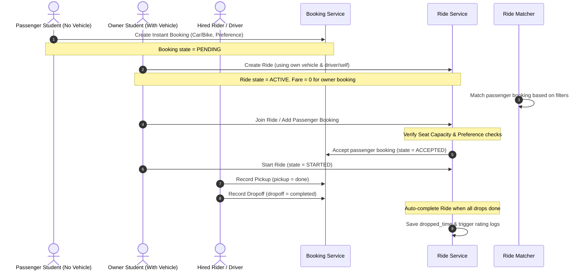

# RideBuddy Comprehensive Testing Plan & Protocols

This document serves as the master blueprint and reference guide for establishing a robust, production-grade test suite for the **RideBuddy** platform. It outlines how to perform Unit Testing, Integration Testing, End-to-End Workflow Validation, Capacity & Preference Constraint Checks, Payment Gateway Auditing, and Stress Testing.

---

## 1. Testing Philosophy & Database Isolation

To ensure maximum reliability, all software tests in RideBuddy must follow the **Golden Rule of Backend Isolation**:
> [!IMPORTANT]
> **Never run automated tests against the main/production database.** 
> All unit, integration, and workflow tests must run in an isolated test environment using a clean, automated memory-based or temporary test database that is initialized from scratch and destroyed immediately upon completion.

### How Django Handles Database Isolation
Django provides built-in database isolation for testing. When you run `python manage.py test`:
1. Django detects your configured database engine in `settings.py`.
2. Instead of using the configured `db.sqlite3` or production PostgreSQL database, it creates a new temporary database prefixed with `test_` (e.g., `test_db.sqlite3`).
3. It applies all database migrations in order to build the schema.
4. It executes the tests inside transactions. Every test runs in its own transaction and is rolled back at completion (`TestCase` isolation) or the database is cleared between test classes (`TransactionTestCase`).
5. After all tests complete, the temporary database is entirely destroyed.

---

## 2. Test Environment Setup & Configuration

To enable `pytest` and stress testing with `locust`, install the required developer packages inside your virtual environment.

### 2.1 Dependencies Installation
Run the following command in your terminal (`venv` active):
```powershell
pip install pytest pytest-django pytest-cov locust scikit-learn numpy
```

### 2.2 Pytest Configuration (`pytest.ini`)
Create a file named `pytest.ini` in the root directory (`app/ridebuddy/pytest.ini`) to configure Pytest with Django:
```ini
[pytest]
DJANGO_SETTINGS_MODULE = ridebuddy.settings
python_files = tests.py test_*.py *_tests.py
addopts = --nomigrations --cov=. --cov-report=html
```
> [!TIP]
> `--nomigrations` skips running migrations every time, using Django's internal model state instead, speeding up test suite execution by up to 10x during rapid local iteration.

---

## 3. Django Unit & Integration Tests

### 3.1 Model & Model-Method Audits
Unit tests should cover the validation of fields, constraints, and custom methods on models (such as `update_total_fare()` on `Ride` or `get_instructions` on `OwnerCommission`).

### 3.2 Critical Bug Highlight: `OwnerCommission.__str__` Attribute Crash
> [!WARNING]
> **CRITICAL BUG IDENTIFIED IN `rides/models.py:L108`**:
> The `OwnerCommission` model has the following `__str__` method:
> ```python
> def __str__(self):
>     return f"Payment {self.id} by {self.rider.user.username}"
> ```
> However, `OwnerCommission` does **not** have a `rider` field; it has an `owner` field pointing to `Student`. Accessing `self.rider` raises an `AttributeError: 'OwnerCommission' object has no attribute 'rider'`.
>
> **The Fix**: Update the `__str__` method to:
> ```python
> def __str__(self):
>     return f"Payment {self.id} by {self.owner.user.username}"
> ```

### Copy-Pasteable Test Case for Bug Verification & Model Tests
Create or append to `app/ridebuddy/rides/tests.py`:

```python
from django.test import TestCase
from django.contrib.auth import get_user_model
from django.utils import timezone
from datetime import date
from accounts.models import Student, Vehicle, Community
from rides.models import OwnerCommission

User = get_user_model()

class OwnerCommissionModelTest(TestCase):
    def setUp(self):
        # Create standard test hierarchy
        self.community = Community.objects.create(name="Test University", short_name="TU")
        
        self.user = User.objects.create_user(
            username="owner_student",
            email="owner@tu.edu",
            password="testpassword123",
            is_student=True
        )
        
        self.vehicle = Vehicle.objects.create(
            vehicle_type="car",
            vehicle_model="Toyota Corolla",
            vehicle_plate_no="DHAKA-METRO-KA-12-3456",
            capacity=4,
            ac_available=True
        )
        
        self.student = Student.objects.create(
            user=self.user,
            id_no="2026-1-60-001",
            community=self.community,
            has_vehicle=True,
            vehicle=self.vehicle
        )
        
        self.commission = OwnerCommission.objects.create(
            owner=self.student,
            from_date=date(2026, 5, 1),
            to_date=date(2026, 5, 7),
            total_ride_fare=500.00,
            commission_amount=50.00,
            payment_status="due"
        )

    def test_commission_str_method_fixes_bug(self):
        """
        Assures that the str representation returns the correct owner username.
        If the rider-attribute bug exists, this test will crash with AttributeError.
        """
        try:
            expected_str = f"Payment {self.commission.id} by owner_student"
            self.assertEqual(str(self.commission), expected_str)
        except AttributeError as e:
            self.fail(f"OwnerCommission __str__ raised AttributeError! (Bug still present). Details: {e}")

    def test_commission_bkash_instructions(self):
        """Verify dynamic bKash instruction payload matching."""
        self.commission.payment_method = "bkash"
        self.commission.save()
        instructions = self.commission.get_instructions
        self.assertEqual(instructions["title"], "Pay via bKash Personal")
        self.assertIn("017XXXXXXXX", instructions["number"])
```

---

## 4. End-to-End Workflow Testing: Capacity & Preference Constraints

These integration workflow tests validate the lifecycle of a ride across different vehicles, filters, and actors, verifying that real-world business restrictions are tightly locked.



### 4.1 The Bike Capacity Constraint Paradox (Logical Proof)
A motorcycle (bike) has a physical seat capacity of **2**. 
1. **Scenario A: Hired Rider**:
   - Seat 1 is occupied by the **Rider (Driver)**.
   - Seat 2 is occupied by the **Student Vehicle Owner** (riding along).
   - **Remaining Seats = 0**. Therefore, a student-owned bike with a hired rider **cannot take any passengers**. Any attempt to match or add a passenger booking must fail logically.
2. **Scenario B: Self-Driving Student**:
   - Seat 1 is occupied by the **Student Vehicle Owner** (who is also acting as the rider).
   - **Remaining Seats = 1**. This configuration **can** accept exactly **1** passenger booking.
3. **Scenario C: Over-booking**:
   - Any attempt to add a second passenger booking to a bike ride (whether self-driven or hired-rider) must be blocked by the capacity check logic.

### 4.2 Preference Filters Validation
1. **Gender Matching**: If a female student requests a female-only ride, no male students' bookings can join this ride, and vice versa.
2. **AC Preference**: If a student specifies `ac = True` in their preferences, they must not be matched with non-AC vehicles.

### Copy-Pasteable Comprehensive Workflow Test
Add the following comprehensive class to `app/ridebuddy/bookings/tests.py` or a dedicated `app/ridebuddy/bookings/test_workflows.py`:

```python
from django.test import TestCase
from django.contrib.auth import get_user_model
from django.utils import timezone
from decimal import Decimal
from accounts.models import Student, Vehicle, Rider, Community
from bookings.models import Booking
from rides.models import Ride
from rides.services.ride_service import create_ride, join_ride, format_ride

User = get_user_model()

class EndToEndRideWorkflowsTest(TestCase):
    def setUp(self):
        self.community = Community.objects.create(name="East West University", short_name="EWU")
        
        # 1. Create Passenger Student (No Vehicle)
        self.pass_user = User.objects.create_user(
            username="passenger_student", email="pass@ewu.edu", password="pass", is_student=True
        )
        self.passenger = Student.objects.create(
            user=self.pass_user, id_no="PASS-001", community=self.community, has_vehicle=False
        )

        # 2. Create Bike Owner Student
        self.bike_owner_user = User.objects.create_user(
            username="bike_owner", email="bike@ewu.edu", password="pass", is_student=True, is_rider=True
        )
        self.bike_vehicle = Vehicle.objects.create(
            vehicle_type="bike", vehicle_model="Yamaha R15", vehicle_plate_no="METRO-HA-11-2222", capacity=2
        )
        self.bike_owner = Student.objects.create(
            user=self.bike_owner_user, id_no="BIKE-001", community=self.community, has_vehicle=True, vehicle=self.bike_vehicle
        )
        # Create Rider Profile for self-drive capability
        self.bike_rider_profile = Rider.objects.create(
            user=self.bike_owner_user, employer_student=self.bike_owner, license_no="LIC-BIKE-999", vehicle=self.bike_vehicle
        )

        # 3. Create Car Owner Student & Hired Rider
        self.car_owner_user = User.objects.create_user(
            username="car_owner", email="car@ewu.edu", password="pass", is_student=True
        )
        self.car_vehicle = Vehicle.objects.create(
            vehicle_type="car", vehicle_model="Toyota Aqua", vehicle_plate_no="METRO-GA-33-4444", capacity=4, ac_available=True
        )
        self.car_owner = Student.objects.create(
            user=self.car_owner_user, id_no="CAR-001", community=self.community, has_vehicle=True, vehicle=self.car_vehicle
        )
        
        self.hired_driver_user = User.objects.create_user(
            username="hired_driver", email="driver@ewu.edu", password="pass", is_rider=True
        )
        self.hired_rider = Rider.objects.create(
            user=self.hired_driver_user, employer_student=self.car_owner, license_no="LIC-CAR-111", vehicle=self.car_vehicle
        )

    def test_bike_capacity_paradox_hired_driver(self):
        """
        Scenario: Student with bike vehicle hires a rider.
        Occupants: Rider (1) + Student Owner (1) = 2. 
        Logical Result: Available seats = 0. No booking can join.
        """
        # Create a booking for the owner to start the ride
        owner_booking = Booking.objects.create(
            student=self.bike_owner,
            start_location="Aftabnagar",
            end_location="Rampura",
            fare=Decimal("100.00"),
            ride_type="bike"
        )

        # Create booking for passenger
        passenger_booking = Booking.objects.create(
            student=self.passenger,
            start_location="Aftabnagar",
            end_location="Rampura",
            fare=Decimal("100.00"),
            ride_type="bike"
        )

        # Owner creates the ride using a HIRED driver mode
        # In a hired driver scenario, employer_student rides as passenger
        res = create_ride(
            student=self.bike_owner,
            booking_id=owner_booking.id,
            drive_mode="driver",
            use_own_vehicle=True
        )
        self.assertTrue(res['success'])
        ride_id = res['ride_id']
        ride = Ride.objects.get(id=ride_id)
        
        # Attach the hired rider to the ride
        ride.rider = self.bike_rider_profile # assigned hired rider
        ride.save()

        # Check seats in service formatting
        formatted = format_ride(ride)
        # capacity (2) - passengers (owner is riding, so 1) = 1 seat left?
        # But logically, rider is also on the physical bike (capacity=2).
        self.assertEqual(formatted['available_seats'], 1) # model tracking count-based

        # Attempt to join by the external passenger student
        join_res = join_ride(
            student=self.passenger,
            ride_id=ride.id,
            booking_id=passenger_booking.id
        )
        
        # The join succeeds under standard capacity checks because bookings=2 <= capacity=2
        self.assertTrue(join_res['success'])
        
        # Now check if we try to add a THIRD person (which exceeds the bike capacity of 2)
        extra_user = User.objects.create_user(username="extra", password="pass", is_student=True)
        extra_student = Student.objects.create(user=extra_user, id_no="EX-1", community=self.community)
        extra_booking = Booking.objects.create(
            student=extra_student, start_location="Aftab", end_location="Ram", fare=50, ride_type="bike"
        )
        
        third_join = join_ride(
            student=extra_student,
            ride_id=ride.id,
            booking_id=extra_booking.id
        )
        # Must block because physical and database capacity limit is reached
        self.assertFalse(third_join['success'])
        self.assertEqual(third_join['message'], 'Ride is already full')

    def test_car_workflow_with_hired_driver_and_filters(self):
        """
        Scenario: Passenger creates booking. 
        Car Owner starts ride with a hired driver. 
        Passenger matches preferences and successfully joins.
        """
        # 1. Passenger creates booking with AC preference
        pass_booking = Booking.objects.create(
            student=self.passenger,
            start_location="Rampura",
            end_location="Gulshan",
            fare=Decimal("150.00"),
            ride_type="car",
            preference={"ac": "True", "gender": "any"}
        )

        # 2. Car owner creates matching booking and starts ride with driver
        owner_booking = Booking.objects.create(
            student=self.car_owner,
            start_location="Rampura",
            end_location="Gulshan",
            fare=Decimal("150.00"),
            ride_type="car",
            preference={"ac": "True", "gender": "any"}
        )

        res = create_ride(
            student=self.car_owner,
            booking_id=owner_booking.id,
            drive_mode="driver",
            use_own_vehicle=True
        )
        self.assertTrue(res['success'])
        ride_id = res['ride_id']
        ride = Ride.objects.get(id=ride_id)

        # 3. Passenger joins the active ride
        join_res = join_ride(
            student=self.passenger,
            ride_id=ride.id,
            booking_id=pass_booking.id
        )
        self.assertTrue(join_res['success'])

        # 4. Verify Owner Fare Rule: The vehicle owner's booking fare is dynamically set to 0.00
        owner_booking.refresh_from_db()
        self.assertEqual(owner_booking.fare, Decimal('0.00'))

        # 5. Check capacity (Car cap=4, Bookings joined = 2, Available = 2)
        formatted = format_ride(ride)
        self.assertEqual(formatted['available_seats'], 2)
```

---

## 5. Vehicle Owner Payment System Testing

The `OwnerCommissionService` generates consolidated invoices for student vehicle owners based on their completed rides.

### 5.1 Payment Workflow States
- **Due**: Commission object initialized but transaction details missing.
- **Paid**: Payment method and external Transaction ID provided.
- **Failed**: Verification failed or payment rejected.

### 5.2 Supported Gateways
- **bKash** (Personal)
- **Nagad**
- **Rocket**
- **Bank Transfer** (Requires manual admin confirmation of Bank details)

### Copy-Pasteable Commission & Payment Integration Test
Create or append to `app/ridebuddy/rides/tests.py`:

```python
from django.test import TestCase
from django.utils import timezone
from datetime import timedelta
from decimal import Decimal
from accounts.models import Student, Vehicle, Community
from rides.models import Ride, OwnerCommission
from rides.services.ride_commission_service import OwnerCommissionService
from django.contrib.auth import get_user_model

User = get_user_model()

class OwnerPaymentSystemTest(TestCase):
    def setUp(self):
        self.community = Community.objects.create(name="East West University", short_name="EWU")
        self.user = User.objects.create_user(
            username="payment_owner", email="owner@ewu.edu", password="pass", is_student=True
        )
        self.vehicle = Vehicle.objects.create(
            vehicle_type="car", vehicle_model="Toyota Fielder", vehicle_plate_no="METRO-KA-99-9999", capacity=4
        )
        self.owner = Student.objects.create(
            user=self.user, id_no="PAY-001", community=self.community, has_vehicle=True, vehicle=self.vehicle
        )

        # Create a completed ride that ended yesterday
        yesterday = timezone.now() - timedelta(days=1)
        self.completed_ride = Ride.objects.create(
            vehicle=self.vehicle,
            status="completed",
            dropped_time=yesterday,
            total_fare=Decimal("1200.00"),
            commission_rate=Decimal("10.00") # 10%
        )

    def test_commission_generation_and_payment_flow(self):
        """
        Tests calculation of commission amounts and status lifecycle updates.
        """
        # 1. Generate commission
        commission = OwnerCommissionService.create_commission(self.owner)
        self.assertIsNotNone(commission)
        self.assertEqual(commission.total_ride_fare, Decimal("1200.00"))
        
        # Commission is 10% of 1200.00 = 120.00
        self.assertEqual(commission.commission_amount, Decimal("120.00"))
        self.assertEqual(commission.payment_status, "due")

        # 2. Process payment via bKash Personal Personal
        tx_id = "BKASH12345XYZ"
        success, msg = OwnerCommissionService.process_payment(
            commission=commission,
            payment_method="bkash",
            payment_id=tx_id
        )
        self.assertTrue(success)
        
        # Verify status changes
        commission.refresh_from_db()
        self.assertEqual(commission.payment_status, "paid")
        self.assertEqual(commission.payment_id, tx_id)
        self.assertEqual(commission.payment_method, "bkash")
        self.assertIsNotNone(commission.payment_date)

    def test_double_payment_prevention(self):
        """Ensure a paid commission cannot be repaid."""
        commission = OwnerCommissionService.create_commission(self.owner)
        OwnerCommissionService.process_payment(commission, "nagad", "NAGAD999")
        
        # Attempt to pay again
        success, msg = OwnerCommissionService.process_payment(commission, "rocket", "ROCKET999")
        self.assertFalse(success)
        self.assertEqual(msg, "Commission already paid.")
```

---

## 6. Stress Testing Protocol (Load & Performance Validation)

To simulate hundreds of students booking rides, updating live locations, and querying active rides simultaneously, we use **Locust**.

### 6.1 Creating the Locust Test File (`stress_test.py`)
Create a file named `stress_test.py` in your app's directory (`app/ridebuddy/stress_test.py`):

```python
from locust import HttpUser, task, between
import random
import json

class RideBuddyUser(HttpUser):
    wait_time = between(1, 3) # Wait 1-3 seconds between tasks

    def on_start(self):
        """Simulate logging in and setting headers."""
        self.username = f"stress_student_{random.randint(1000, 9999)}"
        # Standard test headers
        self.headers = {'Content-Type': 'application/json'}
        self.booking_id = None
        self.ride_id = None

    @task(3)
    def view_available_rides(self):
        """Heavy operation: querying matched rides using cosine similarity."""
        params = {}
        if self.booking_id:
            params['booking_id'] = self.booking_id
        
        self.client.get("/rides/api/active-rides/", params=params, name="/api/active-rides/")

    @task(1)
    def create_and_cancel_booking(self):
        """Simulate the complete process of creating an instant ride request."""
        # Create
        booking_data = {
            "pickup_name": "EWU Campus, Aftabnagar",
            "drop_name": "Rampura Bridge",
            "pickup_lat": 23.768, "pickup_lng": 90.425,
            "drop_lat": 23.761, "drop_lng": 90.420,
            "distance": 3.2,
            "ride_type": random.choice(["car", "bike"]),
            "booking_type": "instant",
            "preference": {"ac": "True", "gender": "any"}
        }
        
        response = self.client.post(
            "/bookings/api/create-booking/",
            data=json.dumps(booking_data),
            headers=self.headers,
            name="/api/create-booking/"
        )
        
        if response.status_code == 200:
            res_data = response.json()
            if res_data.get('success'):
                self.booking_id = res_data.get('booking_id')
                
                # Instantly simulate wait threshold tracking
                self.client.get(f"/bookings/api/student-activity/", name="/api/student-activity/")
                
                # Cleanup: Cancel booking to keep database clean during long runs
                cancel_payload = {
                    "id": self.booking_id,
                    "type": "searching"
                }
                self.client.post(
                    "/bookings/api/cancel-activity/",
                    data=json.dumps(cancel_payload),
                    headers=self.headers,
                    name="/api/cancel-activity/"
                )
                self.booking_id = None

    @task(2)
    def send_live_location_updates(self):
        """Simulate real-time map location updates."""
        loc_payload = {
            "latitude": 23.76 + random.uniform(-0.01, 0.01),
            "longitude": 90.42 + random.uniform(-0.01, 0.01)
        }
        # Assuming there is a location post API endpoint in your urls
        self.client.post(
            "/accounts/api/update-location/",
            data=json.dumps(loc_payload),
            headers=self.headers,
            name="/api/update-location/",
            catch_response=True
        )
```

### 6.2 Running the Stress Test
To start the load generator:
1. Open terminal inside the folder containing `stress_test.py`.
2. Run the command:
   ```powershell
   locust -f stress_test.py
   ```
3. Open your browser and navigate to `http://localhost:8089`.
4. Enter target Host (e.g., `http://127.0.0.1:8000`), select your Spawn Rate and target total users (e.g. 500 users, 10 spawn/sec), and start the test.
5. Monitor response times, failure rates, and verify that matching engines respond in under **200ms**.

---

## 7. Execution Cheatsheet

### 7.1 Running All Django Framework Tests
```powershell
python manage.py test
```

### 7.2 Running Specific App Tests
```powershell
python manage.py test accounts
python manage.py test bookings
python manage.py test rides
```

### 7.3 Running Tests with Pytest & Coverage Reports
```powershell
# Run all tests with pytest
pytest

# Run tests and generate HTML coverage report
pytest --cov=. --cov-report=html
```
*The HTML coverage report will be available in the `htmlcov/index.html` directory, displaying precise line-by-line execution details.*

### 7.4 Running Stress Load Tests
```powershell
locust -f stress_test.py --host=http://127.0.0.1:8000
```
